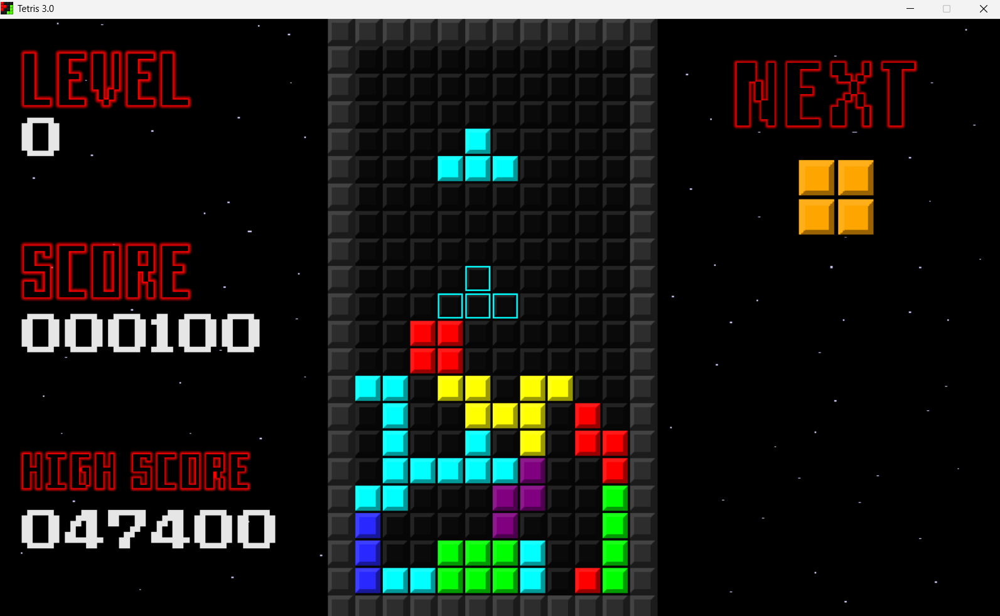

# TETRIS in Python3 with Pygame

A classic Tetris game implemented in Python using the Pygame library. This project was originally developed as a school assignment and has since been improved for readability, modularity, and documentation.



## Features

- Classic Tetris gameplay
- Line clearing and scoring system
- High score tracking
- Dynamic difficulty scaling over time
- Pause functionality
- Animated background with custom UI

## Controls

| Action              |  Key  |
|---------------------|-------|
| Move Left           |   ←   |
| Move Right          |   →   |
| Rotate Piece        |   ↑   |
| Soft Drop           |   ↓   |
| Hard Drop           | Space |
| Pause (controls)    |  ESC  |
| Cycle color schemes |  C/X  |
| Toggle ghost piece  |   H   |

## Requirements

- Python 3.8+
- Pygame 2.0+

## How to Run

1. Install dependencies:
   ```bash
   pip install pygame
   ```

2. Run the game:
   ```bash
   python Tetris.py
   ```

Or download the *latest release* to get the executable file.

## About

This game implementation was originally developed as my final year project in middle school. It was originally only meant to showcase my Python skills. The documentation is written for non-technical audience and only in Slovak language. While the program itself is very simple and often ineffective, I feel like having older projects in their original form allows me to highlight my progress as a software engineer.

The program was compiled into an executable and thanks to my lack of knowledge at the time, I had to compile it from a single file. That's why the original version has all the code in a single .py file. It can still be viewed in the *legacy* folder. 

The project still has space to grow. My future considerations include the translation and refinement of the original documentation into English, focusing more on the programmer audience.

## Future improvements

- High score leaderboard
- Music and soundeffects
- Performance optimization
- Linux release
- Mac release

## Legacy versions

You can find *legacy* folder in the project, which contains the first version from 2023, with the original write-up in Slovak.

##  Credits

Originally created as a high school final project. Now open-sourced and improved. All work except the fonts was done by me.
